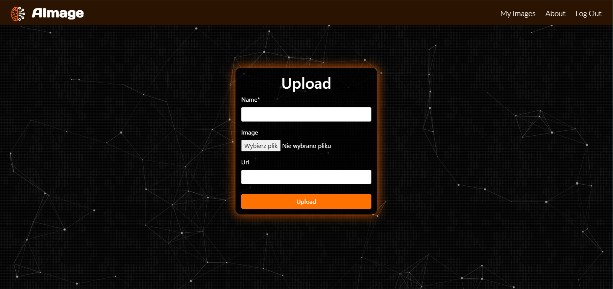

[![Contributors][contributors-shield]][contributors-url]
[![AGPL License][license-shield]][license-url]
[![Release][release-shield]][release-url]

<!-- PROJECT LOGO -->
<br />
<p align="center">
  <a>
    
  </a>
  <h1 align="center">AImage</h1>
  <p align="center">
    <a href="https://github.com/DrDEXT3R/AImage/"><strong>Project Link »</strong></a>
  </p>
</p>


<!-- TABLE OF CONTENTS -->
<details open="open">
  <summary>Table of Contents</summary>
  <ol>
    <li>
      <a href="#about-the-project">About The Project</a>
      <ul>
        <li><a href="#demo">Demo</a></li>
        <li><a href="#built-with">Built With</a></li>
      </ul>
    </li>
    <li><a href="#features">Features</a></li>
    <li>
      <a href="#getting-started">Getting Started</a>
      <ul>
        <li><a href="#prerequisites">Prerequisites</a></li>
        <li><a href="#installation">Installation</a></li>
      </ul>
    </li>
    <li><a href="#workflow">Workflow</a></li>
    <li>
      <a href="#implementation-description">Implementation Description</a>
      <ul>
        <li><a href="#google-drive">Google Drive</a></li>
      </ul>
    </li>
    <li><a href="#authors">Authors</a></li>
    <li><a href="#license">License</a></li>
    <li><a href="#acknowledgements">Acknowledgements</a></li>
  </ol>
</details>


<!-- ABOUT THE PROJECT -->
## About The Project
Web application that allows User to improve the quality of low-resolution images using the deep learning model. 
The logged in User can also store orginal and improved images on the server.

### Demo
#### Desktop Version
 
#### Mobile Version


#### Result


#### Upload images from local disk or url

#### Upload images from google drive

#### Log in to google drive

#### Select an image from google drive

#### User images list 

#### Delete image


### Built With
* [Python 3](https://docs.python.org/3/) - a programming language
* [HTML](https://html.spec.whatwg.org/multipage/) - a language for describing the structure of websites
* [Sass](https://sass-lang.com/documentation) - a stylesheet language that is compiled to CSS
* [JavaScript](https://developer.mozilla.org/en-US/docs/Web/JavaScript) - a programming language that allows you to implement complex features on web pages
* [Django](https://docs.djangoproject.com/en/3.1/) - a high-level Python Web framework
* [Docker](https://docs.docker.com/) - a containerization technology
* [Bootstrap](https://getbootstrap.com/docs/4.5/getting-started/introduction/) - a framework for developing responsive and mobile-first websites
* [Particles.js](https://github.com/VincentGarreau/particles.js/) - a lightweight JavaScript library for creating particles
* [Leaflet](https://leafletjs.com/reference-1.7.1.html) - a open-source JavaScript library for mobile-friendly interactive maps
* [OpenStreetMap](https://www.openstreetmap.org/help) - a free, editable map of the whole world 
* [Google Picker API](https://developers.google.com/picker/docs) - a JavaScript API that allows users to open and upload files in Google Drive.
* [Neural Enhance](https://github.com/alexjc/neural-enhance) - a deep learning model


<!-- FEATURES -->
## Features

- **User registration and login**
- **Logged in User features**:
  - Storing images on the server
  - Loading images from disk, by entering a URL or from Google Drive
  - Improving images stored on the server using the neural network
  - Improving images without saving them to the server using the neural network
  - Adding feedback on image processing results
- **Not logged in User features**:
  - Improving images (with a size limit) using the neural network without being able to save images to the server 
- **"About" tab with the access map**

<!-- GETTING STARTED -->
## Getting Started

These instructions allow you to run a copy of the project on your local computer for programming and testing purposes.

### Prerequisites
1. Python 3
```sh
sudo apt-get update
sudo apt-get upgrade
sudo apt-get install python3.8 
sudo apt-get install python3-pip
```
2. Docker  
```sh
sudo apt-get install docker.io
```

### Installation
1. Clone the repo
```sh
git clone https://github.com/DrDEXT3R/AImage.git
```
2. Install the necessary dependencies
```sh
pip install -r requirements.txt
```
3. Create database
```sh
cd aimagesite
python manage.py makemigrations
python manage.py migrate
```
In our project we use sqlite3 database. If you want to use different kind of database it's no problem, because Django uses ORM. 
All you have to do is change the database settings in the aimagesite/aimagesite/settings.py file:   


4. Run local server
```sh
python manage.py runserver
```
5. Open local server  
http://127.0.0.1:8000/

<!-- WORKFLOW -->
## Workflow
1. See the [Issues](https://github.com/DrDEXT3R/AImage/issues) and the [Projects](https://github.com/DrDEXT3R/AImage/projects) sections.
2. Make changes
3. Open a Pull Request

### Branches
Code Flow Branches:
- Master - ```master```  
The branch with the last working version of the project. 
- Development - ```develop```  
The main branch on which users' work is assembled.

Temporary Branches:
- Feature - ```feature/branch-name```  
A branch on which all work related to software implementation is performed.
- Release - ```release/vX.X```  
A preparatory branch for the release of the project version.
- Bug Fix - ```bugfix/branch-name```  
This is a fix that needs to be implemented.
- Hot Fix - ```hotfix/branch-name```  
This is a fix that must be included in the project version as soon as possible.


<!-- IMPLEMENTATION DESCRIPTION -->
## Implementation Description

In this chapter we'll describe the most interesting code snippets and features that we think might be useful in other projects.

### Google Drive
In this section we will describe how to create the feature of uploading images from google drive      
      
   
**Creating project in google developer console**   
The first thing you need to do is create a project in the google developer console. Google developer console you can find [here]( https://console.developers.google.com/). You can create an account there or log in with your google account, if you have one. The first step is to create new project.   

  

   
The next step is to create credentials. Go to the credentials tab, click *create credentials* and create all the credentials:  *API key*, *OAuth client ID* and *Service account*   
 

 Follow the next steps and complete the necessary informations. **Remember during creating *OAuth consent screen* to add test users who will be able to use the app while it is in test mode** It is also important to add Authorized URIs during creating *OAuth Client ID*. If you'll be using local server, you should specifiy it like that:      
      

 After creating all credentials, you can go to *Dashboard* tab and enable APIs that you want to use in your project. In our project we use *Google Drive API* and *Google Picker API*.        
       
   
   

**Google Picker API usage**    
The Google Picker API is a JavaScript API you can use in your Web apps to enable users to open or upload Google Drive files. A detailed description of this API with examples can be found in the documentation that you can find [here](https://developers.google.com/picker/docs). In our project usage of Google Picker API you can see in [upload_from_gd.js](https://github.com/DrDEXT3R/AImage/blob/release/v1.0/aimagesite/assets/js/upload_from_gd.js). **If you work on our project and want to use Google Picker API from our google project you should write to [diejdablju](https://github.com/diejdablju) and ask to be added as Test user and get needed credentials.** You can also use own google develop console project and add your own credentials in [upload_from_gd.js](https://github.com/DrDEXT3R/AImage/blob/release/v1.0/aimagesite/assets/js/upload_from_gd.js).      
      
   
   
**Saving the file selected in Google Picker on the server**  
After clicking on image in Google Picker you get information such file name, file url, file id. You can pass this information from a .js file containing google picker api implementations to the template.   
[upload_from_gd.js](https://github.com/DrDEXT3R/AImage/blob/release/v1.0/aimagesite/assets/js/upload_from_gd.js)    
```js 
// A simple callback implementation.
function pickerCallback(data) {
  if (data.action == google.picker.Action.PICKED) {
    var fileId = data.docs[0].id;
    var fileName = data.docs[0].name;
    document.getElementById('id_name').value = fileName;
    document.getElementById('id_file_id').value = fileId;
  }
```   
[upload_from_gd.html](https://github.com/DrDEXT3R/AImage/blob/release/v1.0/aimagesite/images/templates/images/upload_from_gd.html)
```html 
<div class>
  <input type="hidden" name="file_id" class="textinput textInput form-control" id="id_file_id">
</div>
```   
Then you can get this file_id in Django view class associated with this template. In our projects it is [ImageUploadfromGDView](https://github.com/DrDEXT3R/AImage/blob/release/v1.0/aimagesite/images/views.py)   
```python 
file_id = form.data["file_id"]
fobject = self.retrieve_image(file_id)
pil_image = PILimage.open(fobject)
django_file = self.pil_to_django(pil_image)
```  
First step is to retrieve image from google drive. It is done in *retrieve_image* function:
 ```python
def retrieve_image(self, file_id):

  # put json credentials her from service account
  # More info: https://cloud.google.com/docs/authentication
  credz = {
      "type": "service_account",
      "project_id": **************,
      "private_key_id": **************,
      "private_key": **************,
      "client_email": **************,
      "client_id": **************,
      "auth_uri": **************,
      "token_uri": **************,
      "auth_provider_x509_cert_url": **************,
      "client_x509_cert_url": **************,
  }


  credentials = service_account.Credentials.from_service_account_info(credz)
  drive_service = build("drive", "v3", credentials=credentials)

  request = drive_service.files().get_media(fileId=file_id)
  fh = BytesIO()  # this can be used to keep in memory
  downloader = MediaIoBaseDownload(fh, request)
  done = False
  while done is False:
      status, done = downloader.next_chunk()

  return fh
``` 
In credz you should write service account credentials from your google develop console project. If you work on our project and want to use credentials from our google project you should write to [diejdablju](https://github.com/diejdablju) and ask to be added as Test user and get needed credentials.   
Remember to add *Google Drive API* to your google develop project and needed imports to your code:   
 ```python
from googleapiclient.discovery import build
from googleapiclient.http import MediaIoBaseDownload
from google.oauth2 import service_account
```    

Next step is to change downloaded from google drive image as a byte stream into Image object from Pillow library and then change this object into Django ContentFile
 ```python
pil_image = PILimage.open(fobject)
django_file = self.pil_to_django(pil_image)

def pil_to_django(self, image, format="PNG"):
    fobject = BytesIO()
    image.save(fobject, format=format)
    return ContentFile(fobject.getvalue())
```    
   
Last step is to save image on the server 
 ```python
self.imageModel = Image()
self.imageModel.name = name
self.imageModel.author = self.request.user
self.imageModel.header_image.save(form.instance.name, django_file)
self.imageModel.save()
```    

<!-- AUTHORS -->
## Authors

* **Tomasz Strzoda** - [DrDEXT3R](https://github.com/DrDEXT3R)
* **Dawid Macha** - [diejdablju](https://github.com/diejdablju)
* **Marek Hermansa** - [marekhermansa](https://github.com/marekhermansa)


<!-- LICENSE -->
## License

This project is licensed under the GNU Affero General Public License v3.0 - see the [LICENSE](LICENSE) file for details


<!-- ACKNOWLEDGEMENTS -->
## Acknowledgements
* [alexjc](https://github.com/alexjc)


<!-- MARKDOWN LINKS & IMAGES -->
<!-- https://www.markdownguide.org/basic-syntax/#reference-style-links -->
[contributors-shield]: https://img.shields.io/github/contributors/DrDEXT3R/AImage?color=blue&style=for-the-badge
[contributors-url]: https://github.com/DrDEXT3R/AImage/graphs/contributors
[license-shield]: https://img.shields.io/github/license/DrDEXT3R/AImage?style=for-the-badge
[license-url]: https://github.com/DrDEXT3R/AImage/blob/master/LICENSE
[release-shield]: https://img.shields.io/github/v/release/DrDEXT3R/AImage?style=for-the-badge
[release-url]: https://github.com/DrDEXT3R/AImage/releases