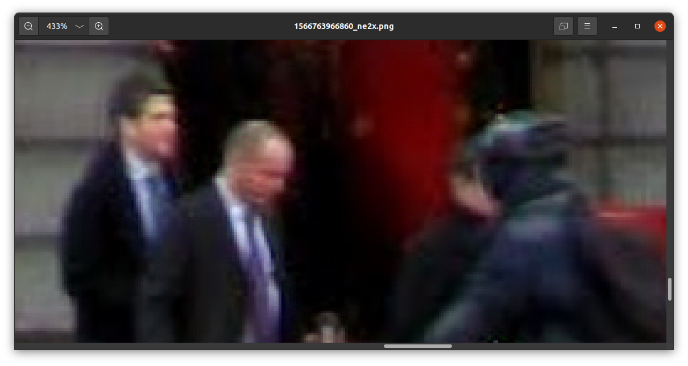
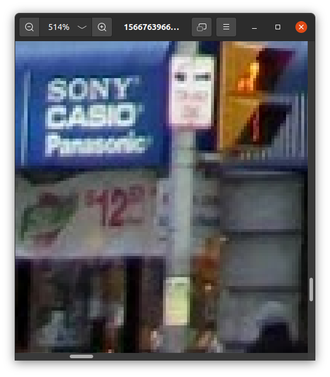

[![Release][release-shield]][release-url]
[![AGPL License][license-shield]][license-url]


<!-- PROJECT LOGO -->
<br />
<p align="center">
  <a>
    
  </a>
  <h1 align="center">AImage</h1>
  <p align="center">
    <a href="https://github.com/DrDEXT3R/AImage/"><strong>Project Link »</strong></a>
  </p>
</p>


<!-- TABLE OF CONTENTS -->
<details open="open">
  <summary>Table of Contents</summary>
  <ol>
    <li>
      <a href="#about-the-project">About The Project</a>
      <ul>
        <li><a href="#demo">Demo</a></li>
        <li><a href="#built-with">Built With</a></li>
      </ul>
    </li>
    <li><a href="#features">Features</a></li>
    <li>
      <a href="#getting-started">Getting Started</a>
      <ul>
        <li><a href="#prerequisites">Prerequisites</a></li>
        <li><a href="#installation">Installation</a></li>
      </ul>
    </li>
    <li><a href="#workflow">Workflow</a></li>
    <li><a href="#authors">Authors</a></li>
    <li><a href="#license">License</a></li>
    <li><a href="#acknowledgements">Acknowledgements</a></li>
  </ol>
</details>


<!-- ABOUT THE PROJECT -->
## About The Project
Web application that allows User to improve the quality of low-resolution images using the deep learning model. 
The logged in User can also store orginal and improved images on the server.

### Demo
#### Desktop Version
 
#### Mobile Version


#### Result




#### Upload images from local disk or url

#### User images list 

#### Delete image


### Built With
* [Python 3](https://docs.python.org/3/) - a programming language
* [HTML](https://html.spec.whatwg.org/multipage/) - a language for describing the structure of websites
* [Sass](https://sass-lang.com/documentation) - a stylesheet language that is compiled to CSS
* [JavaScript](https://developer.mozilla.org/en-US/docs/Web/JavaScript) - a programming language that allows you to implement complex features on web pages
* [Django](https://docs.djangoproject.com/en/3.1/) - a high-level Python Web framework
* [Docker](https://docs.docker.com/) - a containerization technology
* [Bootstrap](https://getbootstrap.com/docs/4.5/getting-started/introduction/) - a framework for developing responsive and mobile-first websites
* [Particles.js](https://github.com/VincentGarreau/particles.js/) - a lightweight JavaScript library for creating particles
* [Leaflet](https://leafletjs.com/reference-1.7.1.html) - a open-source JavaScript library for mobile-friendly interactive maps
* [OpenStreetMap](https://www.openstreetmap.org/help) - a free, editable map of the whole world 
* [Neural Enhance](https://github.com/alexjc/neural-enhance) - a deep learning model


<!-- FEATURES -->
## Features

- **User registration and login**
- **Logged in User features**:
  - Storing images on the server
  - Loading images from disk or by entering a URL
  - Improving images stored on the server using the neural network
  - Improving images without saving them to the server using the neural network
  - Adding feedback on image processing results
- **Not logged in User features**:
  - Improving images (with a size limit) using the neural network without being able to save images to the server 
- **"About" tab with the access map**

<!-- GETTING STARTED -->
## Getting Started

These instructions allow you to run a copy of the project on your local computer for programming and testing purposes.

### Prerequisites
1. Python 3
```sh
sudo apt-get update
sudo apt-get upgrade
sudo apt-get install python3.8 
sudo apt-get install python3-pip
```
2. Docker  
```sh
sudo apt-get install docker.io
```

### Installation
1. Clone the repo
```sh
git clone https://github.com/DrDEXT3R/AImage.git
```
2. Install the necessary dependencies
```sh
pip install -r requirements.txt
```
3. Create database
```sh
cd aimagesite
python manage.py makemigrations
python manage.py migrate
```
In our project we use sqlite3 database. If you want to use different kind of database it's no problem, because Django uses ORM. 
All you have to do is change the database settings in the ```aimagesite/aimagesite/settings.py``` file:   


4. Run local server
```sh
python manage.py runserver
```
5. Open local server  
http://127.0.0.1:8000/

<!-- WORKFLOW -->
## Workflow
1. See the [Issues](https://github.com/DrDEXT3R/AImage/issues) and the [Projects](https://github.com/DrDEXT3R/AImage/projects) sections.
2. Make changes
3. Open a Pull Request

### Branches
Code Flow Branches:
- Master - ```master```  
The branch with the last working version of the project. 
- Development - ```develop```  
The main branch on which users' work is assembled.

Temporary Branches:
- Feature - ```feature/branch-name```  
A branch on which all work related to software implementation is performed.
- Release - ```release/vX.X```  
A preparatory branch for the release of the project version.
- Bug Fix - ```bugfix/branch-name```  
This is a fix that needs to be implemented.
- Hot Fix - ```hotfix/branch-name```  
This is a fix that must be included in the project version as soon as possible.


<!-- AUTHORS -->
## Authors

* **Tomasz Strzoda** - [DrDEXT3R](https://github.com/DrDEXT3R)
* **Dawid Macha** - [diejdablju](https://github.com/diejdablju)
* **Marek Hermansa** - [marekhermansa](https://github.com/marekhermansa)


<!-- LICENSE -->
## License

This project is licensed under the GNU Affero General Public License v3.0 - see the [LICENSE](LICENSE) file for details


<!-- ACKNOWLEDGEMENTS -->
## Acknowledgements
* [alexjc](https://github.com/alexjc)


<!-- MARKDOWN LINKS & IMAGES -->
<!-- https://www.markdownguide.org/basic-syntax/#reference-style-links -->
[license-shield]: https://img.shields.io/github/license/DrDEXT3R/AImage?style=for-the-badge
[license-url]: https://github.com/DrDEXT3R/AImage/blob/master/LICENSE
[release-shield]: https://img.shields.io/github/v/release/DrDEXT3R/AImage?style=for-the-badge
[release-url]: https://github.com/DrDEXT3R/AImage/releases